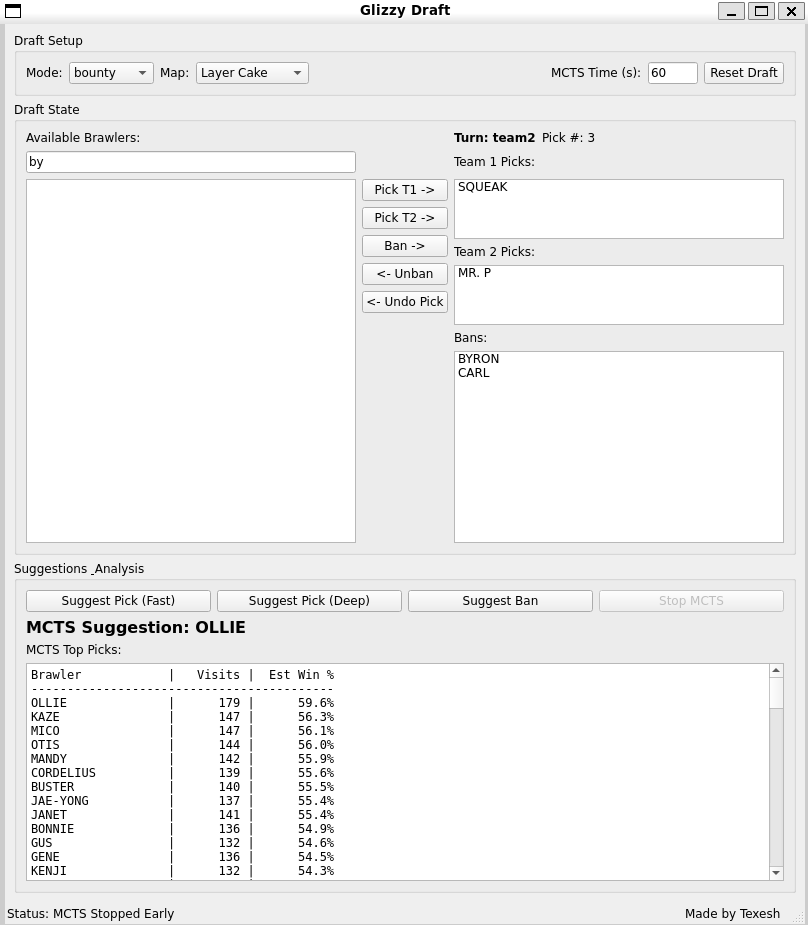

# Advanced Draft Strategy Tool

**A strategic drafting companion for Brawl Stars.**



**Important:** Because recommendations are produced by an MCTS guided by a heuristic evaluator derived from historical statistics, the tool provides *statistically strong picks on average* — useful guidance for robust choices — but it does not guarantee optimal picks for every individual draft or rare tactical situations.

This application analyses preprocessed statistical data from a binary cache file (`stats.pack`) to provide insights and recommendations during character selection. It prioritises high‑rank games, offers both fast heuristic suggestions and deeper Monte Carlo Tree Search (MCTS) analysis, and exposes a GUI draft simulator to test picks and bans interactively.

---

## Features

* **Comprehensive data analysis** — powered by aggregated statistics stored in `stats.pack`.
* **Rank‑weighted statistics** — gives more weight to higher‑rank games to reflect competitive meta trends.
* **Efficient caching** — `stats.pack` is precomputed and updated periodically, allowing near‑instant application startup.
* **Interactive draft simulator** — full GUI to simulate a draft with picks, bans and undo/redo controls.
* **Dual suggestion modes**:

  * *Heuristic Suggestions* — instant recommendations using a weighted formula (win rate, synergy, counters, pick rate).
  * *MCTS Deep Analysis* — multi‑threaded Monte Carlo Tree Search for forward‑looking evaluation.
* **Ban recommendations** — suggests impactful bans for the selected map/mode.
* **Full draft control** — undo picks, unban characters, reset draft.
* **Configurable parameters** — tweak heuristic weights and MCTS settings via `draft_config.ini`.

---

## How it works

The application reads from a precomputed binary cache file (`stats.pack`) containing aggregated, rank‑weighted statistics derived from historical games. All simulator and suggestion features extract information from this cache. The application requires `stats.pack` to run, and new versions of the file can be distributed periodically to update the statistics.

---

## Prerequisites

* C++17 compatible compiler (GCC, Clang, MSVC)
* CMake 3.16+
* Qt 6 (Core, Gui, Widgets, Concurrent modules)
* (Optional) `ninja` or `make` for building

---

## Building from source

```bash
# Clone the repository
git clone <repository-url>
cd <repository-directory>

# Create a build directory and run CMake
mkdir build
cd build
# If Qt is not on the default path, give CMake a hint:
# cmake .. -DCMAKE_PREFIX_PATH=/path/to/Qt/6.x.x/<arch>
cmake ..

# Build the project
cmake --build .
# or, on UNIX with Makefiles:
# make -j$(nproc)
```

The final executable will be placed in the build output directory (e.g. `build/` or `build/bin/` depending on your generator).

---

## Usage

1. **Provide the stats cache**

   The application requires a binary cache file named **`stats.pack`** in the same directory as the executable. The app will refuse to start without it.

2. **First run**

   If `stats.pack` is missing, it must be generated externally and placed in the directory. The app reads this file to populate all internal statistics for simulation and recommendations.

3. **Simulator controls**

   * Select **Mode** and **Map** from the dropdowns to begin a draft.
   * Use the **Available Brawlers** list to pick a character.
   * Click **Pick T1**, **Pick T2**, or **Ban** to perform actions. Double‑click performs the likely default action (pick or ban depending on turn).
   * **Undo Pick**, **Unban**, and **Reset Draft** are available to revert changes.
   * **Suggest Pick (Fast)** provides an instant heuristic recommendation.
   * **Suggest Pick (Deep)** runs MCTS (UI locks while running). Use **Stop MCTS** to cancel early.

---

## Configuration (`draft_config.ini`)

`draft_config.ini` is created on first run and can be edited to tweak behavior.

Example:

```ini
[Settings]
MctsTimeLimit = 10          # seconds (default time limit for MCTS)
SmoothingK = 5              # Laplace smoothing parameter to avoid extreme win rates
RankWeightExponent = 1.5    # exponent controlling rank weighting
PickRateThreshold = 0.01    # minimum pick rate to consider

[Weights]
WinRate = 1.0
Synergy = 0.8
Counter = 0.9
PickRate = 0.3

[MCTS]
Threads = 4
ExplorationConstant = 1.414
MaxDepth = 32

[Paths]
CacheFile = stats.pack

```

**Notes:**

* `MctsTimeLimit` controls how long the deep analysis runs by default.
* `SmoothingK` prevents tiny sample sizes from producing 0% or 100% win rates.
* Heuristic weights (`WinRate`, `Synergy`, `Counter`, `PickRate`) control the scoring used by the fast suggestion mode.

---

## Troubleshooting

* **App refuses to start**: ensure `stats.pack` is present in the executable directory.
* **MCTS runs too long or uses all CPU**: lower `MctsTimeLimit` or `Threads` in `draft_config.ini`.
* **Results look noisy**: increase `SmoothingK` or raise `PickRateThreshold` to ignore very rare picks.

---

## Contributing

Contributions and bug reports are welcome. Please open issues or pull requests against the repository.

---

## License & Contact

Include your preferred license here. For bugs or questions contact: `me@oliver-w.com`.

---

*Happy drafting!*
